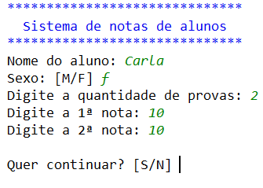
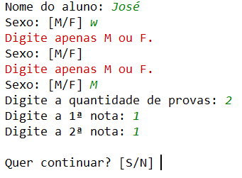
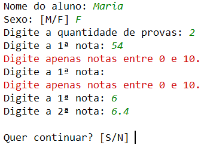
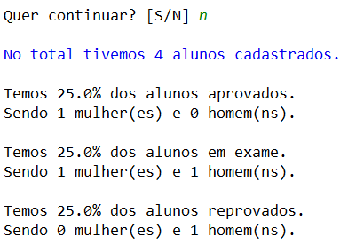

# Sistema de Alunos em Python

### Projeto desenvolvido como requisito parcial para conclusão do curso de *Introdução à Programação Python* do Instituto Federal São Paulo (IFSP) / Campus Sertãozinho. Meu primeiro projeto em programação, utilizando o *PyCharm*.

&nbsp;

O Sistema de Alunos cadastra diversos alunos solicitando o nome, sexo, quantidade de provas e as notas das provas. 
E questiona se quer continuar o cadastro.

&nbsp;

&nbsp;

No campo *sexo* deve apenas digitar M ou F.

&nbsp;

No campo *quantidade de provas* deve digitar apenas números entre 1 e 10.

&nbsp;

No campo *notas* deve digitar apenas números entre 0 e 10.

&nbsp;

Se a média das provas for:

- maior ou igual a 7 o aluno é aprovado;
- menor que 7 e maior que 4 o aluno está de exame;
- menor ou igual a 4 o aluno está reprovado.

&nbsp;

Quando o usuário interrompe o cadastro sinalizando *N* no campo *'Quer continuar'*, o cadastro é interrompido. 
Então, aparece na tela os resultados: quantidade de cadastros com a porcentagem de alunos aprovados, de exame e reprovados e quantidade de homens e mulheres nessas condições.

